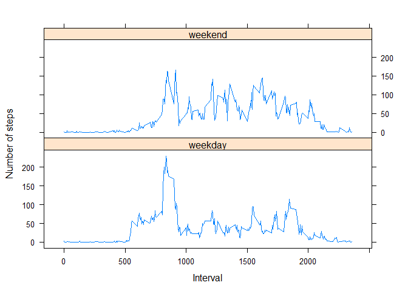

# Reproducible Research: Peer Assessment 1


##   Global Settings


```r
# Set codes to be always visible
echo = TRUE 
```


## Loading and preprocessing the data

1. Unzip the file if it does not exist; 
2. Read the csv file and omit NA data


```r
if (!file.exists("activity.csv")) {
    unzip("activity.zip")
}

    data <- read.csv("activity.csv", colClasses = c("integer", "Date", "factor"))
    data$month <- as.numeric(format(data$date, "%m"))
    omitNA <- na.omit(data)
    rownames(omitNA) <- 1:nrow(omitNA)
    head(omitNA)
```

```
##   steps       date interval month
## 1     0 2012-10-02        0    10
## 2     0 2012-10-02        5    10
## 3     0 2012-10-02       10    10
## 4     0 2012-10-02       15    10
## 5     0 2012-10-02       20    10
## 6     0 2012-10-02       25    10
```

```r
    dim(omitNA)
```

```
## [1] 15264     4
```


## What is mean total number of steps taken per day?

Ignore the missing values and plot a histogram of the number of steps taken each day


```r
library(ggplot2)
```

```
## Warning: package 'ggplot2' was built under R version 3.2.1
```

```r
ggplot(omitNA, aes(date, steps)) + 
    geom_bar(stat = "identity") + 
    facet_grid(. ~ month, scales = "free") + 
    ggtitle("Histogram of Total Steps Taken Each Day") +
    xlab("Date") +
    ylab("Total Number of Steps")
```

 

Calculate the mean and median for the total number of steps taken per day

1. Mean number of steps per day

```r
TotalSum <- aggregate(omitNA$steps, list(Date = omitNA$date), FUN = "sum")$x
mean(TotalSum)
```

```
## [1] 10766.19
```

```r
head(TotalSum)
```

```
## [1]   126 11352 12116 13294 15420 11015
```

2. Median number of steps per day

```r
    median(TotalSum)
```

```
## [1] 10765
```


## What is the average daily activity pattern?

1. Make a time series plot (i.e. type = "l") of the 5-minute interval (x-axis) and the average number of steps taken, averaged across all days (y-axis)


```r
meanSteps <- aggregate(omitNA$steps, list(interval = as.numeric(as.character(omitNA$interval))), FUN = "mean")
head(meanSteps)
```

```
##   interval         x
## 1        0 1.7169811
## 2        5 0.3396226
## 3       10 0.1320755
## 4       15 0.1509434
## 5       20 0.0754717
## 6       25 2.0943396
```

```r
names(meanSteps)[2] <- "aveSteps"
head(meanSteps)
```

```
##   interval  aveSteps
## 1        0 1.7169811
## 2        5 0.3396226
## 3       10 0.1320755
## 4       15 0.1509434
## 5       20 0.0754717
## 6       25 2.0943396
```

```r
ggplot(meanSteps, aes(interval, aveSteps)) + 
    geom_line() + 
    ggtitle("Time Series Plot of the 5-minute Interval") +
    xlab("5-minute intervals") +
    ylab("Average Number of Steps Taken")
```

 

2. Which 5-minute interval, on average across all the days in the dataset, contains the maximum number of steps?

```r
meanSteps[meanSteps$aveSteps == max(meanSteps$aveSteps), ]
```

```
##     interval aveSteps
## 104      835 206.1698
```


## Imputing missing values

Note that there are a number of days/intervals where there are missing values (coded as NA). The presence of missing days may introduce bias into some calculations or summaries of the data.

1. Calculate and report the total number of missing values in the dataset (i.e. the total number of rows with NAs)


```r
sum(is.na(data))
```

```
## [1] 2304
```

2. Devise a strategy for filling in all of the missing values in the dataset. The strategy does not need to be sophisticated. For example, you could use the mean/median for that day, or the mean for that 5-minute interval, etc.

3. Create a new dataset that is equal to the original dataset but with the missing data filled in.


```r
newData <- data 
for (i in 1:nrow(newData)) {
    if (is.na(newData$steps[i])) {
        newData$steps[i] <- meanSteps[which(newData$interval[i] == meanSteps$interval), ]$aveSteps
    }
}

head(newData)
```

```
##       steps       date interval month
## 1 1.7169811 2012-10-01        0    10
## 2 0.3396226 2012-10-01        5    10
## 3 0.1320755 2012-10-01       10    10
## 4 0.1509434 2012-10-01       15    10
## 5 0.0754717 2012-10-01       20    10
## 6 2.0943396 2012-10-01       25    10
```

```r
sum(is.na(newData))
```

```
## [1] 0
```

4. Make a histogram of the total number of steps taken each day and Calculate and report the mean and median total number of steps taken per day. 


```r
ggplot(newData, aes(date, steps)) + 
    geom_bar(stat = "identity", colour = "steelblue", fill = "steelblue", width = 0.7) + 
    facet_grid(. ~ month, scales = "free") + 
    ggtitle("Histogram of Total Number of Steps Taken Each Day (no missing data)") +
    xlab("Date") +
    ylab("Total number of steps")
```

 

Do these values differ from the estimates from the first part of the assignment? What is the impact of imputing missing data on the estimates of the total daily number of steps?

Mean number of steps per day


```r
newTotalSum <- aggregate(newData$steps, list(Date = newData$date), FUN = "sum")$x
newMean <- mean(newTotalSum)
newMean
```

```
## [1] 10766.19
```

Median total number of steps taken per day:


```r
newMedian <- median(newTotalSum)
newMedian
```

```
## [1] 10766.19
```

Compare them with the two before imputing missing data:


```r
oldMean <- mean(TotalSum)
oldMedian <- median(TotalSum)
newMean - oldMean
```

```
## [1] 0
```

```r
newMedian - oldMedian
```

```
## [1] 1.188679
```

After imputing the missing data, new mean of total steps taken per day is the **same** as that of the old mean while the new median of total steps taken per day is **greater** than that of the old median.


## Are there differences in activity patterns between weekdays and weekends?

For this part the weekdays() function may be of some help here. Use the dataset with the filled-in missing values for this part.

1. Create a new factor variable in the dataset with two levels -- "weekday" and "weekend" indicating whether a given date is a weekday or weekend day.


```r
head(newData)
```

```
##       steps       date interval month
## 1 1.7169811 2012-10-01        0    10
## 2 0.3396226 2012-10-01        5    10
## 3 0.1320755 2012-10-01       10    10
## 4 0.1509434 2012-10-01       15    10
## 5 0.0754717 2012-10-01       20    10
## 6 2.0943396 2012-10-01       25    10
```

```r
newData$weekdays <- factor(format(newData$date, "%A"))
levels(newData$weekdays)
```

```
## [1] "Friday"    "Monday"    "Saturday"  "Sunday"    "Thursday"  "Tuesday"  
## [7] "Wednesday"
```

```r
levels(newData$weekdays) <- list(weekday = c("Monday","Tuesday","Wednesday","Thursday","Friday"), 
                                 weekend = c("Saturday", "Sunday"))
levels(newData$weekdays)
```

```
## [1] "weekday" "weekend"
```

```r
table(newData$weekdays)
```

```
## 
## weekday weekend 
##   12960    4608
```

2. Make a panel plot containing a time series plot (i.e. type = "l") of the 5-minute interval (x-axis) and the average number of steps taken, averaged across all weekday days or weekend days (y-axis). The plot should look something like the following, which was created using simulated data:


```r
    meanSteps <- aggregate(newData$steps, list(interval=as.numeric(as.character(newData$interval)), 
                                           weekdays = newData$weekdays), FUN = "mean")
    names(meanSteps)[3] <- "aveSteps"
    library(lattice)
```

```
## Warning: package 'lattice' was built under R version 3.2.1
```

```r
    xyplot(meanSteps$aveSteps ~ meanSteps$interval | meanSteps$weekdays, layout = c(1, 2), type = "l", 
           xlab = "Interval", ylab = "Number of steps")
```

 

